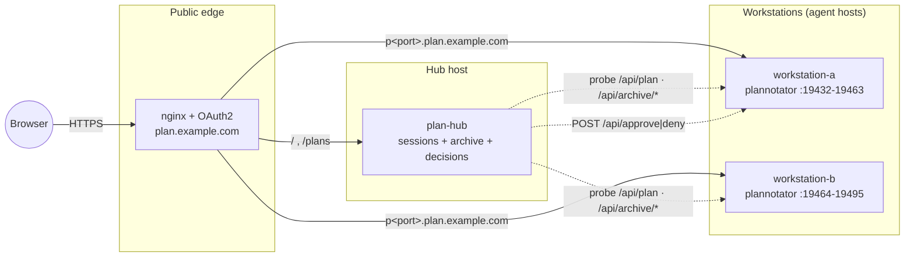

# plannotator-hub

A self-hosted **control plane for [Plannotator](https://plannotator.ai) plan reviews** across one or more agent workstations.

Plannotator is excellent at what it does — it turns an agent's plan into a reviewable page with approve/deny and inline annotations. But each review is an ephemeral, unauthenticated `http://host:port` server on whichever machine the agent is running on. That is fine on a laptop, and awkward the moment you have more than one machine, want to review from a phone, or want to find a plan you approved last month.

This hub fixes that. It gives you:

- **One URL for everything** — `https://plan.example.com` lists every live review across your workstations and forwards to it (behind your own auth).
- **Approve / deny from the hub** — decide a live review without opening the per-session page.
- **An archive browser** — every decided plan, searchable, rendered with Markdown and Mermaid.
- **Stable port-derived URLs** — each review keeps a predictable `p<port>.plan.example.com` address.

It is deliberately **control-plane only**: the hub never sits in the review data path, so if it dies, in-flight reviews are unaffected.

---

## Architecture



Three pieces:

| Piece | Role |
|---|---|
| **plan-hub** (`hub/plan-hub.py`) | Scans each workstation's port range for live reviews, aggregates the archive APIs, serves the two pages, and forwards approve/deny. In-memory, no database. |
| **nginx + OAuth2 proxy** | Terminates TLS, authenticates, routes the apex to the hub and `p<port>.*` to the right workstation. |
| **Workstation services** | `plannotator archive` (read-only archive API) and a daily CLI auto-updater. |

### Why session URLs are port-derived

Plannotator's review UI uses **root-relative** URLs (`/api/plan`, `EventSource('/api/...')`), so a path prefix like `/review/123/` cannot work — only the URL *authority* can vary. The hub therefore uses **one subdomain per port**: `p19432.plan.example.com` → `workstation-a:19432`.

The consequence worth internalising: **port ranges must be disjoint per workstation**, because the public URL encodes only the port.

| Workstation | Range | Public form |
|---|---|---|
| `workstation-a` | `19432-19463` | `p19432` … `p19463` |
| `workstation-b` | `19464-19495` | `p19464` … `p19495` |

---

## Quick start (hub host)

**Requirements:** Linux with systemd, Python 3.9+, nginx, `oauth2-proxy`, and a wildcard DNS record (`*.plan.example.com` → your edge host). A Let's Encrypt cert via `certbot` is assumed.

```bash
git clone https://github.com/TheRealAlexV/plannotator-hub.git
cd plannotator-hub
sudo ./install.sh                 # add --dry-run first if you like
sudo cp systemd/plan-hub.env.example /etc/plan-hub.env
sudoedit /etc/plan-hub.env        # set your workstations + labels
sudo systemctl enable --now plan-hub
curl -s http://127.0.0.1:8899/healthz   # -> ok
```

`/etc/plan-hub.env`:

```ini
HUB_WORKSTATIONS=10.0.0.10:19432-19463,10.0.0.11:19464-19495
HUB_ARCHIVES=10.0.0.10:8897,10.0.0.11:8897
HUB_LABELS=10.0.0.10=workstation-a,10.0.0.11=workstation-b
HUB_PUBLIC_SUFFIX=plan.example.com
HUB_BIND=127.0.0.1
HUB_PORT=8899
```

### nginx

Two server blocks. The apex is the hub; the regex block routes each `p<port>` to its workstation. Both must carry your `auth_request` gate — the upstream review API is **unauthenticated**, so the edge is the only thing protecting it.

```nginx
# apex -> hub
server {
  listen 443 ssl http2;
  server_name plan.example.com;
  ssl_certificate     /etc/letsencrypt/live/plan.example.com/fullchain.pem;
  ssl_certificate_key /etc/letsencrypt/live/plan.example.com/privkey.pem;

  location = /oauth2/auth { internal; proxy_pass http://127.0.0.1:4180; proxy_pass_request_body off;
                            proxy_set_header Content-Length ""; proxy_set_header X-Original-URI $request_uri; }
  location @error401 { return 302 https://auth.example.com/oauth2/start?rd=$scheme://$http_host$request_uri; }
  location / {
    auth_request /oauth2/auth;
    error_page 401 403 = @error401;
    proxy_pass http://127.0.0.1:8899;
    proxy_set_header Host $host;
  }
}

# p<port> -> workstation-a (19432-19463)
server {
  listen 443 ssl http2;
  server_name ~^p(?<pnum>194(3[2-9]|[45][0-9]|6[0-3]))\.plan\.example\.com$;
  ssl_certificate     /etc/letsencrypt/live/plan.example.com/fullchain.pem;
  ssl_certificate_key /etc/letsencrypt/live/plan.example.com/privkey.pem;

  # ... same oauth2 block as above ...

  location / {
    auth_request /oauth2/auth;
    error_page 401 403 = @error401;
    proxy_pass http://10.0.0.10:$pnum;      # IP literal -> no resolver needed
    proxy_http_version 1.1;
    proxy_set_header Upgrade $http_upgrade;
    proxy_set_header Connection "upgrade";
    proxy_buffering off;                    # SSE
    proxy_read_timeout 3600s;
    gzip off;
  }
}

# repeat the regex block for 19464-19495 -> 10.0.0.11
```

### TLS

One cert covering the apex plus every routed port. No wildcard cert is needed (and using one is a broader credential than necessary):

```bash
NAMES="-d plan.example.com"
for p in $(seq 19432 19495); do NAMES="$NAMES -d p$p.plan.example.com"; done
sudo certbot certonly --dns-cloudflare \
  --dns-cloudflare-credentials /etc/letsencrypt/cloudflare.ini \
  --cert-name plan.example.com --expand --non-interactive --agree-tos $NAMES
```

---

## Quick start (each workstation)

```bash
# 1. Install the Plannotator CLI (it is a single self-contained binary)
curl -fsSL https://plannotator.ai/install.sh | bash -s -- --non-interactive --minimal

# 2. Tell reviews to bind wide, inside this workstation's slice, and never
#    try to open a browser. Put this in ~/.bashrc AND ~/.profile:
export PLANNOTATOR_REMOTE=1
export PLANNOTATOR_URL_HOST=10.0.0.10        # this host's LAN IP
export PLANNOTATOR_PORT=19432-19463          # this host's slice
export PLANNOTATOR_SKIP_BROWSER_OPEN=1

# 3. Persist it for harnesses that run a background server, then restart it
opencode service set env PLANNOTATOR_REMOTE 1     # (OpenCode example)
opencode service set env PLANNOTATOR_PORT 19432-19463
opencode service restart

# 4. Archive API + daily auto-update
sudo cp systemd/plannotator-archive.service ~/.config/systemd/user/
cp workstation/plannotator-update.sh ~/.local/bin/
sudo cp systemd/plannotator-update.{service,timer} ~/.config/systemd/user/
systemctl --user daemon-reload
systemctl --user enable --now plannotator-archive plannotator-update.timer
sudo loginctl enable-linger "$USER"
```

Verify a review actually binds where the hub can see it — this is the single most common setup mistake:

```bash
ss -ltnp | grep 194          # want 0.0.0.0:194xx, NOT 127.0.0.1:<random>
curl -s http://10.0.0.10:19432/api/plan | head -c 120
```

A review bound to `127.0.0.1` on a random port means the process serving it did not inherit `PLANNOTATOR_REMOTE`/`PLANNOTATOR_PORT`; it will never appear in the hub and cannot be forwarded.

---

## Harness setup

Plannotator ships first-party integrations for the harnesses below. Install the CLI first (above); most integrations are then installed by the same installer, which auto-detects what you have. `--skip-<harness>` opts a given one out.

> Not every "harness" is one: **Cursor** is not a supported Plannotator harness (it appears only as an AI review-job provider), and there is no harness named "OMP" — those are Pi/SDK concepts.

### OpenCode

Add the plugin to `opencode.json` (global or project):

```jsonc
{
  "$schema": "https://opencode.ai/config.json",
  "plugin": ["@plannotator/opencode@latest"]
}
```

On OpenCode 2 the key is `plugins` and takes objects:

```jsonc
{ "plugins": [{ "package": "@plannotator/opencode@latest", "options": {} }] }
```

- The planning agent calls the `submit_plan` tool; the review opens and the decision is returned to the agent.
- The plugin serves the review **in-process** (its embedded server), which is why the listening socket belongs to the `opencode` process.
- Workflow scope is configurable (`plan-agent` by default; `all-agents` to expose it everywhere).

### Claude Code

```bash
curl -fsSL https://plannotator.ai/install.sh | bash
# then, inside Claude Code:
#   /plugin marketplace add backnotprop/plannotator
#   /plugin install plannotator@plannotator
```

Intercepts `ExitPlanMode` via a `PermissionRequest` hook. Skills land in `~/.claude/skills/plannotator-*`. Manual hook alternative lives in `~/.claude/settings.json`.

### Codex CLI

Run the installer with Codex present; it enables a `Stop` hook (`$CODEX_HOME/hooks.json`, with `[features] hooks = true` in `config.toml`). **Hooks are not available on Windows.** Use the absolute binary path under Codex Desktop, which does not inherit your shell `PATH`.

### Gemini CLI

The installer writes `~/.gemini/policies/plannotator.toml` and a `BeforeTool` hook in `~/.gemini/settings.json`, gating `exit_plan_mode`. Requires Gemini CLI 0.36.0+.

### GitHub Copilot CLI

```bash
# inside Copilot CLI:
#   /plugin marketplace add backnotprop/plannotator
#   /plugin install plannotator-copilot@plannotator
```

Pre-tool hook on `exit_plan_mode`.

### Pi

```bash
pi install npm:@plannotator/pi-extension      # or: pi -e npm:@plannotator/pi-extension
```

Agent tool `plannotator_submit_plan`; config at `~/.pi/agent/plannotator.json` (global) or `.pi/plannotator.json` (project).

### Kiro CLI

Installer-managed skills (`~/.kiro/skills/plannotator-*`) plus an example agent. Kiro has **no plan hook** — the skills are exposed as `skill://` resources and invoked manually.

### Amp / Droid / Vibe (Mistral)

- **Amp** — copy `apps/amp-plugin/plannotator.ts` into `~/.config/amp/plugins/`; command palette only.
- **Droid** — `droid plugin marketplace add https://github.com/backnotprop/plannotator`, then install `plannotator@plannotator`; commands only.
- **Vibe** — installer-managed (`$VIBE_HOME/hooks.toml`, `pre_tool` on `exit_plan_mode`); needs Vibe 2.25+. No docs page yet; Windows needs manual setup.

### Making reviews reachable

Plannotator documents its own remote-access paths — use them, and treat this hub as complementary:

| Mechanism | How |
|---|---|
| Trusted LAN / VPN | `PLANNOTATOR_REMOTE=1 PLANNOTATOR_URL_HOST=devbox.internal` — binds `0.0.0.0` |
| Tailscale (preferred, loopback-only) | `plannotator review --tailscale` (v0.27.0+) |
| SSH tunnel | `ssh -L 19432:127.0.0.1:19432 host`, then open `http://localhost:19432` |
| Devcontainer | `containerEnv: {PLANNOTATOR_REMOTE:"1", PLANNOTATOR_PORT:"19432"}` + `forwardPorts` |

Useful env vars: `PLANNOTATOR_PORT` (single port or `start-end` range), `PLANNOTATOR_URL_HOST` (advertised URL only — it does **not** change the bind), `PLANNOTATOR_BIN`, `PLANNOTATOR_DATA_DIR`, `PLANNOTATOR_SHARE_URL`, `PLANNOTATOR_SKIP_BROWSER_OPEN`.

---

## Hub HTTP API

| Endpoint | Purpose |
|---|---|
| `GET /` | Live sessions page |
| `GET /plans` | Archive browser |
| `GET /api/sessions` | `{now, sessions:[{host, hostLabel, port, mode, project, title, firstSeen, lastSeen}]}` |
| `GET /api/live/plan?host=&port=` | The plan currently under review |
| `POST /api/sessions/decide` | `{host, port, decision:"approve"\|"deny", feedback?}` → forwards to the review server |
| `GET /api/plans` | Merged archive index (`?refresh` to bust the cache) |
| `GET /api/plans/raw?host=&filename=` | Raw archived markdown |
| `GET /healthz` | Liveness |

### About the decision endpoint

`POST /api/sessions/decide` forwards to the review server's `/api/approve` and `/api/deny`. Those routes are part of Plannotator's UI contract — they exist on harness-embedded servers (OpenCode) but **not** on every surface (a bare CLI `annotate` session has no `/api/deny`). The hub degrades gracefully: it returns `{ok:false, status:404}` and the UI says "this session can't be denied remotely — open it instead".

The only integration surface Plannotator documents as stable is **`/api/external-annotations`** (GET/POST/PATCH/DELETE, batch, SSE at `/api/external-annotations/stream`). Everything else under `/api/*` is explicitly same-version UI contract. If a Plannotator release changes those routes, the hub's decision buttons are what breaks — the session list, archive, and per-session links keep working, since they use the documented archive endpoints and plain HTTP proxying.

---

## Security

Read this before exposing anything.

- **The Plannotator review API is unauthenticated** in both local and remote mode. Anyone who can reach the port can read the plan and act on it.
- Therefore: bind reviews to `0.0.0.0` only on a **trusted** network, gate the edge with OAuth (as above), and firewall each workstation so only the hub host can reach the port ranges.
- The hub's archive and decide endpoints are likewise unauthenticated **by design** — it is meant to sit behind your auth proxy, not on the open internet.
- Plan content can include internal detail (paths, code, hostnames). Do not enable public sharing on the review server if that matters to you (`PLANNOTATOR_SHARE_URL`, and Plannotator's own share setting, control this).
- The hub is read-only with respect to your filesystem: it never writes to `~/.plannotator`.

---

## Compatibility

- Hub tested against **Plannotator v0.27.x** and **OpenCode 2.x**.
- The hub itself needs only the Python 3 standard library.
- Workstation port slices must be disjoint across workstations; the hub's workstation list is the single source of truth.

## License

MIT. See [LICENSE](LICENSE).

Plannotator itself is a separate project by [@backnotprop](https://github.com/backnotprop) — this hub is an independent control plane for it and is not affiliated with or endorsed by that project.
